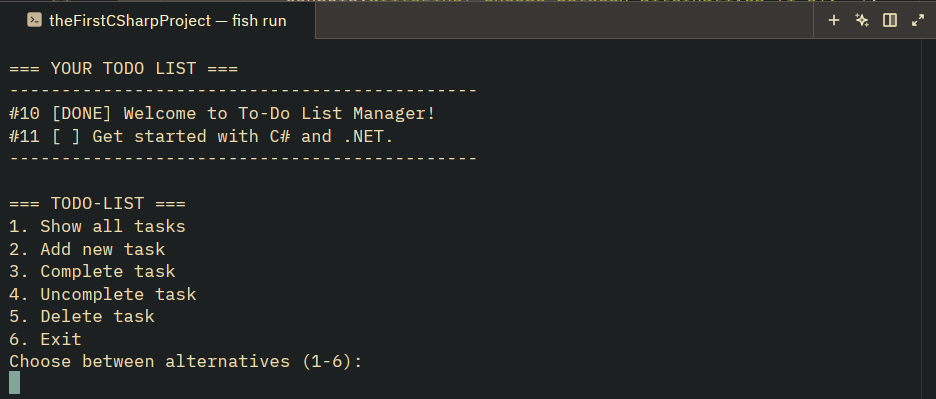

# 📝 Asynchronous CLI TO-DO List Manager

A simple, 3-tier, starter console TO-DO List management application built with:

* **C# (.NET)**
* **Dapper Micro-ORM**
* **MySQL** database
* Running inside a **Docker Compose** setup.

All information is stored locally via the Docker container.  
Built as a preparation project for a .NET System Developer program.

### *Preview*



---

## 🛠️ Tech & Architecture

* **Language**: C# (.NET 10)
* **Database**: MySQL 8.0 (Orchestrated via Docker Compose)
* **Database Management**: phpMyAdmin (`http://localhost:8081`)
* **Micro-ORM**: Dapper (`QueryAsync` & `ExecuteAsync`)
* **Architecture Pattern**: Repository Pattern (`ITodoRepository` / `MySqlTodoRepository`)
* **Execution Model**: Asynchronous I/O (`async` / `await` & `Task`)

---

## ✨ Featured Operations

* 📋 **Show All Tasks**: Fetches and displays all todo items with completion status (`[DONE]` vs `[  ]`).
* ➕ **Add Task**: Inserts new tasks safely using SQL parameterization (`@Title`).
* ✅ **Complete Task**: Marks a task as `[DONE]` in MySQL.
* ↩️ **Uncomplete Task**: Resets task completion status through setting `is_completed` to `0`.
* 🗑️ **Delete Task**: Removes a task from the table.
* 🔒 **No Log-in Required**: All tasks and information stored **locally**, meaning there is no need for log-in or data collection.

---

## 🚀 Instructions on How to Run

### Prerequisites
* [.NET 10 SDK](https://dotnet.microsoft.com/) (or .NET 8+)
* [Docker](https://www.docker.com/) & Docker Compose

### Step 1: Start the Database Container

In the project's root directory, launch MySQL and phpMyAdmin:

```bash
docker compose up -d
```

### Step 2: Run the Application

Launch the C# console application from the **root** directory:

```bash
dotnet run
```

---

## 📁 Project Structure

```text
├── Program.cs               # Console UI Presentation Layer
├── ITodoRepository.cs       # Data Access Interface Contract
├── MySqlTodoRepository.cs   # Dapper Data Access Layer
├── TodoItem.cs              # Domain Model Class
├── docker-compose.yml       # Docker Database Configuration
└── TheFirstC#Project.csproj # Project Manifest & NuGet Dependencies
```
